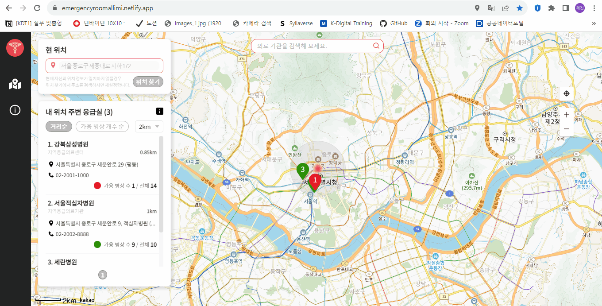
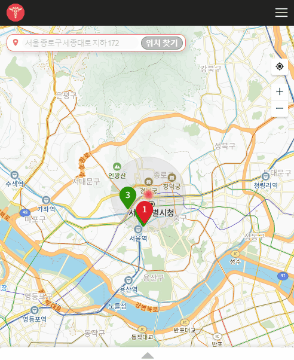

# 🚨 응급실 알리미

**응급실 알리미**는 경증 질환의 일반인을 대상으로 한 플랫폼으로, 사용자 주변의 응급실 위치와 각 응급실의 가용 병상 정보를 한 눈에 파악하기 쉽게 하는 것을 목표로 만들었습니다.

## 🔗 링크

- 응급실 알리미 **실 배포 사이트** 👉 [배포 사이트 링크](https://emergencyroomallimi.netlify.app/)
- 아래와 같이 **상세 정보**를 얻고 싶다면? 👉 [Notion 링크](https://jumpy-cornet-222.notion.site/b03a40c47d5f434d8559f8b14d4a61e2?pvs=4)
  - 응급실 알리미 소개
  - 기획 및 디자인 설계
  - 기능 명세서
  - API 명세서
  - 개발 문서
  - 이슈 및 해결 과정
  - convention
- 응급실 알리미에서 활용한 공공데이터 👉 [공공데이터포털 링크](https://www.data.go.kr/iim/api/selectAPIAcountView.do)

## 🧩 주요 페이지 소개

### 1️⃣ 응급실 목록 페이지

> 💻 Laptop size

> 📱 Mobile size

### 2️⃣ 응급실 상세 페이지

> 💻 Laptop size

> 📱 Mobile size

## 🎯 학습 목표

- **React**를 사용해 재사용 가능한 component를 만드는 법을 익히기
- **Emotion**을 사용해 스타일링하는 법을 익히기
- **Recoil**을 사용해 전역 상태 관리 방법을 익히기
- **React-Query**를 사용해 서버 상태 관리 방법을 익히기
- **React-Router**를 사용해 SPA(Single Page Application)을 구현하기
- **Responsive** Application을 구현하기
- **Storybook**을 사용해 UI 컴포넌트를 문서화하기
- **Google Analytics**를 사용해 web traffic 추적하기
- **Lighthouse**를 사용해 웹 성능 측정하기

## 🔧 사용한 기술 스택

- Language: `JavaScript`
- UI: `React`
- Client-side Routing: `React-Router`
- Client-State 관리: `Recoil`
- Server-State 관리: `React-Query`
- Style: `Emotion`
- React 개발 환경: `Vite`
- Package Manager: `yarn`
- Hosting Service: `Netlify`
